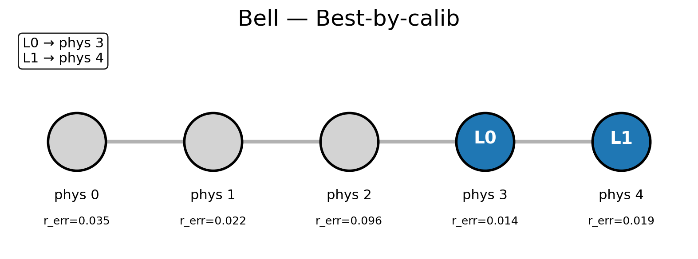

# RL-QC: Reinforcement Learning for Adaptive Noise-Aware Quantum Compilation

This project is the baseline for a future reinforcement learning pipeline for adaptive noise-aware quantum compilation.

As an initial experiment, it explores strategies for mapping logical qubits to physical qubits on noisy quantum devices. It evaluates the performance of various mapping algorithms under realistic noise models using Qiskit's fake provider backends.

This initial experiment serves as proof that different mapping strategies drastically alter performance. Additionally, the code used to simulate quantum compilations serves as a baseline for future RL adaptations, where an agent will make mapping decisions rather than heuristics and algorithms.

Additionally, the framework for an RL pipeline using concepts in the noise-mapping experiment is detailed. A Gymnasium environment for a noise-aware RL agent is partially implemented, as well as a very basic PPO training script.

## Features

- **Multiple Mapping Strategies**:
  - Random mapping (baseline)
  - Calibration-based best/worst mappings
  - Murali-inspired reliability optimization
  - Tannu-VQA-like connectivity-based mapping

- **Circuit Benchmarks**:
  - Bell state preparation
  - GHZ state (3 qubits)
  - Adder circuit (quantum ripple carry adder)

- **Noise-Aware Evaluation**:
  - Simulates readout and two-qubit gate errors
  - Computes success probabilities via Monte Carlo sampling
  - Generates hardware mapping visualizations

- **Extensible Framework**:
  - Easy to add new circuits and mapping strategies
  - Supports various IBM Quantum fake backends
  - Provides an RL environment (`RLCompiler`) and example training script for learned mapping

## Installation

This project uses [uv](https://github.com/astral-sh/uv) for dependency management.

1. Clone the repository:
   ```bash
   git clone https://github.com/ryanluedtke/RL-QC.git
   cd rl-qc
   ```

2. Install dependencies:
   ```bash
   uv sync
   ```

3. Activate the virtual environment:
   ```bash
   source .venv/bin/activate
   ```

## Usage

Run the main experiment script:

```bash
uv run python src/noise_mapping_experiment/noise_mapping_exp.py [options]
```

### Command-Line Options

- `--backend`: Fake backend to use (default: `FakeManilaV2`)
  - Available: `FakeManilaV2`, `FakeLimaV2`, `FakeQuitoV2`, `FakeBogotaV2`, `FakeRomeV2`
- `--shots`: Number of measurement shots (default: 4096)
- `--seed`: Random seed for reproducibility (default: 0)
- `--random_trials`: Number of random mapping trials (default: 10)
- `--omega`: Weight for readout vs. gate errors in calibration scoring (default: 0.5)
- `--out-dir`: Directory for output visualizations (default: `src/noise_mapping_experiment/mapping_visualizations/`)

### Example

```bash
uv run python src/noise_mapping_experiment/noise_mapping_exp.py --backend FakeManilaV2 --shots 4096 --seed 42
```

This will:
- Run experiments on all benchmark circuits
- Compare mapping strategies
- Generate mapping visualization images
- Print success probabilities and layouts

## Output

The script generates:
- Console output with success rates for each mapping strategy and circuit
- PNG visualization files showing qubit mappings on hardware topology
- Bar chart comparing success probabilities across methods

## Example Visualization

Below is an example of a qubit mapping visualization generated by the script:



*Figure: Best calibration-based mapping for the Bell circuit on FakeManilaV2 backend.*

## Reinforcement Learning Compiler (RLCompiler)

This repository includes an experimental Gymnasium environment for learning noise-aware qubit mappings.
The core is `RLCompiler` in `src/rl_compiler/rlcompiler.py`, which defines:

- **Action space**: selects a physical qubit index to place the next logical qubit.
- **Observation space**: a concatenated vector containing:
  - current logical→physical mapping
  - which logical qubits are placed
  - which physical qubits are occupied
  - readout error rates for all physical qubits
  - (room for more observation info to be implemented)
- **Reward modes** (configurable via `reward_mode`):
  - `murali_proxy`: a proxy score based on readout and path reliability (inspired by Murali et al.)
  - `canary_success`: a canary success probability computed from simulator execution (placeholder)

### Example training script

An example training scaffold is provided in `src/rl_compiler/train.py`.

```bash
uv run python src/rl_compiler/train.py
```

This script is intentionally minimal, using placeholders for the circuit and backend configuration. It is a very basic starting point for building a full RL training pipeline.

The script sets up a Proximal Policy Optimization (PPO) model from Stable Baselines3. PPO is expected to work well in this project due to its success for discretized action spaces.

## Project Structure

```
rl-qc/
├── pyproject.toml          # Project configuration and dependencies
├── README.md              # This file
├── src/
│   ├── noise_mapping_experiment/
│   │   ├── noise_mapping_exp.py  # Main experiment script
│   │   └── mapping_visualizations/  # Output directory for plots
│   └── rl_compiler/
│       ├── rlcompiler.py        # RL environment
│       └── train.py             # Example training script
```

## Dependencies

Key dependencies (managed via `pyproject.toml`):
- `qiskit`: Quantum circuit simulation
- `qiskit-aer`: High-performance simulator
- `qiskit-ibm-runtime`: Access to fake backends
- `numpy`: Numerical computations
- `matplotlib`: Plotting and visualizations
- `networkx`: Graph algorithms for hardware topology
- `gymnasium`, `stable-baselines3`: For RL components

## Authors

Ryan Luedtke

## Acknowledgments

This work builds upon research in quantum circuit compilation and noise-aware mapping strategies, including methods inspired by Murali et al. and Tannu et al.

- Murali et al., *Noise-Adaptive Compiler Mappings for Noisy Intermediate-Scale Quantum Computers*, ASPLOS 2019.  
- Tannu & Qureshi, *A Case for Variability-Aware Policies for NISQ-Era Quantum Computers*, arXiv 2018.